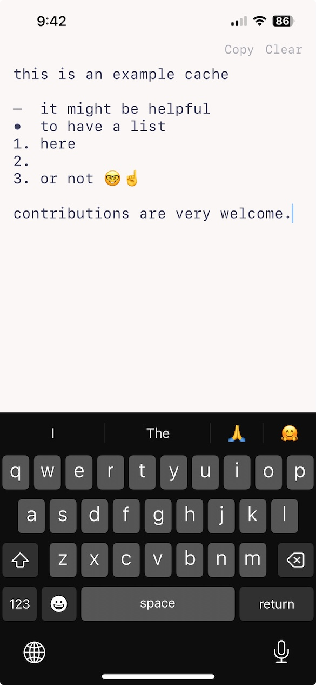

# Cache App

A minimalist, fast scratchpad for iPhone and iPad with smart list formatting, autosave, and quick Copy/Clear actions. Ideal for capturing thoughts, todos, and snippets without distractions, as if it were the back of a napkin.

## Interface

## Features

- **Smart lists**: Type `*` + space for bullets, `-` + space for dashes, or `1.` + space for numbered lists. Hitting return continues the list automatically; empty list markers are cleaned up. Should function like the traditional apple notes app
- **Autosave**: Your note is saved automatically and restored on next launch.
- **Copy/Clear**: Only one tap is required to copy to clipboard or clear the screen.

## How it works

- **SwiftUI shell + UIKit editor**: The main view (`ContentView`) hosts a `RichTextEditor` built with `UIViewRepresentable` over `UITextView` for rich text behaviors.
- **List intelligence**: The editor watches your keystrokes to:
  - Convert markers like `*`, `-`, or `1.` into bullet/dash/numbered list prefixes when you press space.
  - Continue the current list on return.
  - Remove an empty list line if you hit return on a line that only contains a marker.
- **Persistence**: The note is stored as RTF data from an `NSAttributedString` in `UserDefaults`, so it survives app restarts.

## Requirements

- Xcode 16.4 or later (project template was created with this version)
- iOS/iPadOS deployment target is currently set to 18.5 in the project settings. You can lower this in the target settings if you need to run on earlier OS versions.

## Installation

Seeing as I was not about to fork over the $99 for an Apple developer subscription, you have to run it through Xcode.

1. Once you have opened the cloned repo in Xcode, select the `Cache` scheme.
2. Choose a compatible connected device or one of the iPhone or iPad simulators.
3. Press Run (⌘R).

## Project structure

- `Cache/CacheApp.swift`: App entry point (SwiftUI `App`).
- `Cache/ContentView.swift`: Main UI; Copy/Clear actions; autosave/load.
- `Cache/RichTextEditor.swift`: `UITextView`-backed editor with list formatting logic.
- `CacheTests`, `CacheUITests`: Unit and UI test targets (Xcode templates, to be modified soon).

## MIT License

Do whatever you want with it.